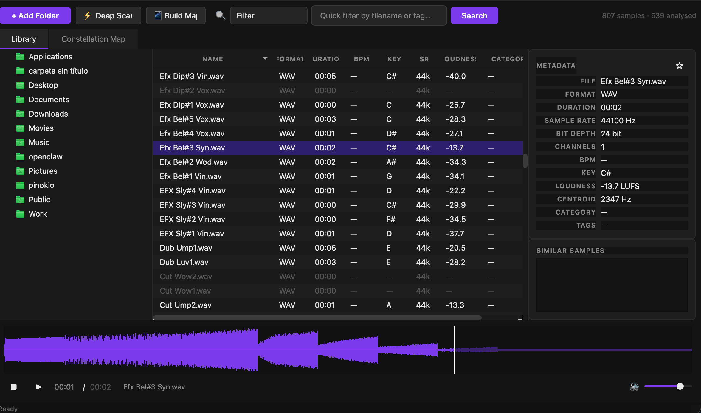
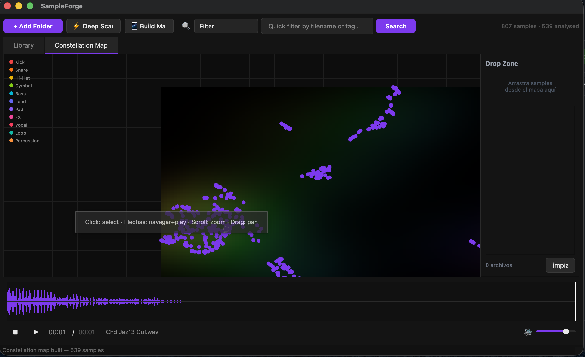

# SampleForge

**AI-Powered Audio Sample Manager** — Organize, analyze, and explore your entire sample library using deep audio embeddings and semantic search.

SampleForge uses the [CLAP](https://github.com/LAION-AI/CLAP) model to understand the *sound* of every file in your library — not just its filename. Find what you're looking for by describing it in plain text, or explore your collection visually on an interactive 2D map.

---

## Screenshots



*Library view — browse samples with full metadata: format, duration, BPM, key, loudness, sample rate, and waveform preview.*



*Constellation Map — every sample plotted in 2D space by sonic similarity. Color-coded by category. Click any dot to preview and drag to your project.*

---

## Features

- **Deep Scan** — Analyzes audio files using CLAP embeddings (48kHz, 512-dim vectors). Runs in parallel batches.
- **Text Search** — Describe what you need ("dark evolving pad", "punchy kick with room") and get semantically matched results.
- **Constellation Map** — Interactive 2D visualization built with UMAP. Sonically similar samples cluster together.
- **Rich Metadata** — Automatic extraction of BPM, musical key, loudness (LUFS), spectral centroid, format, bit depth, and more.
- **Fast Filter** — Instant filtering by filename, tag, or category across your entire library.
- **Waveform Player** — Built-in audio player with real-time waveform display. Keyboard-navigable.
- **Vector Database** — ChromaDB-backed storage for fast similarity queries at scale.
- **Cross-platform** — macOS (Apple Silicon & Intel) and Windows.

---

## Supported Formats

`.wav` · `.flac` · `.aiff` · `.aif` · `.mp3` · `.ogg` · `.m4a` · `.opus`

---

## Installation

### macOS

```bash
git clone https://github.com/Marcosblancarg/SamlpeForge.git
cd SamlpeForge
pip install -r requirements.txt
python main.py
```

Or run the bundled app:

```bash
chmod +x install.sh
./install.sh
```

### Windows

Download the latest pre-built release from the [Actions tab](../../actions):

1. Go to **Actions** → latest **Build Windows EXE** run
2. Download the `SampleForge-Windows` artifact
3. Extract the `.zip`
4. Run `SampleForge.exe` inside the extracted folder

> **Note:** Windows Defender may show a warning on first run since the app is not code-signed. Click "More info" → "Run anyway".

---

## Requirements

| Dependency | Version |
|---|---|
| Python | 3.10 – 3.12 |
| PySide6 | ≥ 6.6.0 |
| PyTorch | ≥ 2.1.0 |
| transformers | ≥ 4.36.0 |
| chromadb | ≥ 0.4.22 |
| librosa | ≥ 0.10.1 |
| umap-learn | ≥ 0.5.5 |

Full list in [`requirements.txt`](requirements.txt).

---

## How It Works

```
Audio files
    │
    ▼
librosa / soundfile          ← load & resample to 48kHz
    │
    ▼
CLAP (laion/clap-htsat-unfused)   ← generate 512-dim audio embedding
    │
    ▼
ChromaDB                     ← store & query by vector similarity
    │
    ▼
UMAP                         ← reduce to 2D for Constellation Map
    │
    ▼
PySide6 UI                   ← display, filter, play, explore
```

---

## Project Structure

```
SampleForge/
├── main.py                  # Entry point
├── config.py                # Global settings
├── requirements.txt
├── core/
│   ├── analyzer.py          # CLAP embedding pipeline
│   ├── catalog.py           # SQLite metadata store
│   ├── player.py            # Audio playback engine
│   ├── scanner.py           # Folder scanner & batch processor
│   └── vector_store.py      # ChromaDB interface
├── ui/
│   ├── main_window.py       # Main application window
│   ├── styles/              # QSS dark theme
│   └── widgets/
│       ├── constellation.py # 2D UMAP map widget
│       ├── library_view.py  # Sample table
│       ├── player_bar.py    # Playback controls
│       ├── search_bar.py    # Search & filter bar
│       ├── waveform_view.py # Waveform renderer
│       └── metadata_panel.py
└── utils/
    └── audio_utils.py
```

---

## Building from Source (Windows EXE)

The GitHub Actions workflow builds the Windows executable automatically on every push to `main`.

To build manually on Windows:

```bash
pip install pyinstaller
pip install -r requirements.txt
pyinstaller SampleForge_Windows.spec
# Output: dist/SampleForge/SampleForge.exe
```

---

## License

MIT — free to use, modify, and distribute.
